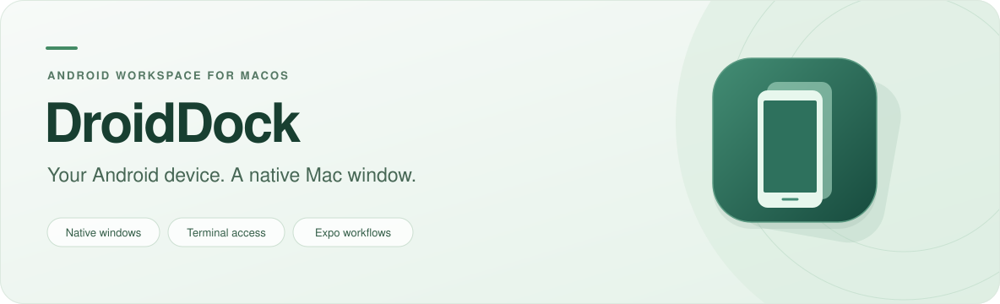

<p align="center">
  
</p>

<p align="center">
  Run Android virtual devices in a native macOS window.<br>
  Control them from Terminal, test with Expo, and keep your development tools close.
</p>

<h3 align="center">
  <a href="https://github.com/SuryaSriramD/DroidDock/releases/download/v0.2.1/DroidDock-macOS.dmg">Download DroidDock for macOS ↓</a>
</h3>

<p align="center">
  Apple Silicon · macOS 13+ · v0.2.1 Development Preview<br>
  <a href="https://github.com/SuryaSriramD/DroidDock/releases/tag/v0.2.1">Release notes</a> ·
  <a href="https://github.com/SuryaSriramD/DroidDock/releases/download/v0.2.1/DroidDock-macOS.dmg.sha256">SHA-256 checksum</a>
</p>

<p align="center">
  <a href="#features">Features</a> ·
  <a href="#get-started">Get started</a> ·
  <a href="#terminal-and-expo">Terminal &amp; Expo</a> ·
  <a href="#build-from-source">Build from source</a> ·
  <a href="#documentation">Documentation</a>
</p>

> **Development preview:** The downloadable app is ad-hoc signed and has not been notarized by Apple. macOS may block a downloaded copy. Developer ID signing, notarization, and broader compatibility testing remain release work.

## Features

| A native device window | Tools for app testing | Ready for Terminal |
| --- | --- | --- |
| A floating toolbar, rounded phone frame, rotation, fullscreen, and saved display scales. | Install APKs, capture screenshots, record video, and stream Logcat. | List, boot, and control devices with the `droiddock` command. |
| Interact with touch, drag, scroll, keyboard, and hardware controls. | Transfer clipboard content explicitly, manage snapshots, and export diagnostics. | Use your running Android device with Expo through the same Android SDK. |

DroidDock runs Google's Android Emulator headlessly and displays the device through a native client for the bundled scrcpy server. It uses your existing Android SDK and virtual devices.

## Get started

### 1. Prepare your Mac

| Requirement | What you need |
| --- | --- |
| **Mac** | Apple Silicon running macOS 13 or newer. The download is an `arm64` build; Intel support has not been validated. |
| **Android SDK** | Android Emulator and Platform-Tools installed. |
| **Virtual device** | An existing AVD with a compatible `arm64-v8a` system image. Create one in Android Studio's Device Manager. |
| **Resources** | Enough free memory and disk space for your virtual device. |

Android SDK tools and system images are installed separately. You do not need Xcode or Python to run the downloaded app.

### 2. Install DroidDock

1. [Download the DMG](https://github.com/SuryaSriramD/DroidDock/releases/download/v0.2.1/DroidDock-macOS.dmg) and quit any running copy of DroidDock or the older Android Simulator app.
2. Open the disk image and drag **DroidDock → Applications**.
3. Eject the disk image, then open **DroidDock** from Applications.

### 3. Start your device

Confirm the Android SDK path in **Settings**, select your virtual device, and choose **Start Device**. Once Android finishes booting, you can interact with it in the device window or use it from your development tools.

## Terminal and Expo

### Add the terminal command

In DroidDock, choose **Settings → Terminal → Copy Terminal Install Command** and run the copied command. For an app installed in Applications, you can also run:

```sh
/bin/bash "/Applications/DroidDock.app/Contents/Resources/install-cli.sh"
export PATH="$HOME/.local/bin:$PATH"
```

The installer creates `~/.local/bin/droiddock`. Add `~/.local/bin` to your shell's PATH for future sessions; the installer does not edit shell profiles or overwrite an existing command.

### Launch an Android device

```sh
droiddock list
droiddock boot Pixel_10_Pro
```

Replace `Pixel_10_Pro` with an ID returned by `droiddock list`. The command boots the device and opens its DroidDock window.

### Connect your Expo project

With the device running, start Expo from your project directory:

```sh
npx expo start
```

Press **Shift+A** to choose the running Android device, or **A** to open Android. Expo and DroidDock must use the same Android SDK so Expo can find the device through ADB.

<details>
<summary><strong>More terminal commands</strong></summary>

```sh
# Check device state in scripts
droiddock status Pixel_10_Pro --json

# Install a local APK
droiddock install Pixel_10_Pro /absolute/path/app.apk

# Open a URL in the device
droiddock open-url Pixel_10_Pro 'https://example.com'

# Stop the device
droiddock stop Pixel_10_Pro

# Browse available commands
droiddock --help
```

The terminal client controls the same app-owned runtime as the UI. Devices started by another application remain externally managed. Set `DROIDDOCK_APP` or pass `--app '/path/DroidDock.app'` to select a specific app bundle.

</details>

## Build from source

Use the **Swift 6 toolchain** from Xcode or compatible Command Line Tools.

```sh
git clone https://github.com/SuryaSriramD/DroidDock.git
cd DroidDock
swift test --disable-sandbox
./scripts/build.sh
open "artifacts/DroidDock.app"
```

The build script creates an ad-hoc-signed macOS app.

<details>
<summary><strong>Package a DMG</strong></summary>

After building the app, install Python 3.10 or newer and run:

```sh
./scripts/package-dmg.sh
```

The packager creates `artifacts/DroidDock-macOS.dmg` and its SHA-256 checksum. It uses isolated, hash-pinned dependencies under `.build/dmg-tools`, generates Retina installer artwork, and verifies the disk image, app contents, signatures, and Finder layout. The existing app binary is preserved. Set `DROIDDOCK_DMG_PYTHON` to select a Python executable.

</details>

<details>
<summary><strong>Development names and upgrade compatibility</strong></summary>

The internal Swift package and executable are still named `AndroidSimulator`. For an unpackaged development run, use `swift run AndroidSimulator` from the repository root.

The app retains its existing bundle and storage identifiers, preserving preferences and runtime history across the rename to DroidDock. The legacy `android-simulator` command and URL scheme remain compatible.

</details>

## Project status

DroidDock is available as a **development preview for Apple Silicon**. Device creation currently happens in Android Studio; managed SDK downloads and a full device-creation wizard are planned work.

Video recording exports video-only MP4 files, up to three minutes per recording. Clipboard transfer is explicit rather than continuous synchronization.

The v0.2.0 baseline passed **175 automated tests**. The v0.2.1 rename passed **25 focused tests**. The redesigned DMG passed package-integrity checks and a native Finder visual check, and the uploaded installer was independently reverified on **12 September 2026**. These are scoped checks, not validation across every macOS version or Intel hardware. See the [validation record](docs/VALIDATION.md) for details and limitations.

## Documentation

| Resource | Purpose |
| --- | --- |
| [Validation record](docs/VALIDATION.md) | Test results, manual checks, and known limitations. |
| [Requirements audit](docs/REQUIREMENTS_AUDIT.md) | Implemented requirements and remaining work. |
| [Implementation plan](docs/IMPLEMENTATION_PLAN.md) | Architecture, delivery stages, and development scope. |
| [Development notes](docs/DEVELOPMENT_NOTES.md) | Detailed implementation and historical verification notes. |
| [Product requirements](docs/specifications/Android_Simulator_macOS_PRD.txt) | Original product definition. |
| [Technical requirements](docs/specifications/Android_Simulator_macOS_TRD.txt) | Original technical specification. |

Builds, caches, local logs, and runtime evidence are excluded from source control. Historical evidence paths in the development documents refer to local files; downloadable installers are published under [Releases](https://github.com/SuryaSriramD/DroidDock/releases).

## License

DroidDock is distributed under the [Apache License 2.0](LICENSE). The bundled scrcpy server includes its own [license](Resources/scrcpy-LICENSE.txt) and [provenance notice](Resources/scrcpy-NOTICE.txt).
