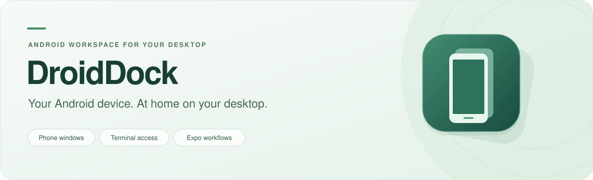

<p align="center">
  
</p>

<p align="center">
  Android virtual devices in your desktop workspace.<br>
  Available for macOS, Windows, and Linux.<br>
  Control them from Terminal, test with Expo, and keep your development tools close.
</p>

<h3 align="center">
  <a href="https://github.com/SuryaSriramD/DroidDock/releases/download/v0.4.4/DroidDock-macOS.dmg">Download DroidDock for macOS ↓</a>
</h3>

<p align="center">
  Apple Silicon · macOS 13+ · v0.4.4 Development Preview<br>
  <a href="https://github.com/SuryaSriramD/DroidDock/releases/tag/v0.4.4">Release notes</a> ·
  <a href="https://github.com/SuryaSriramD/DroidDock/releases/download/v0.4.4/DroidDock-macOS.dmg.sha256">SHA-256 checksum</a>
</p>

<p align="center">
  <a href="#features">Features</a> ·
  <a href="#get-started">Get started</a> ·
  <a href="#terminal-and-expo">Terminal &amp; Expo</a> ·
  <a href="#build-from-source">Build from source</a> ·
  <a href="#documentation">Documentation</a>
</p>

> **Development preview:** The downloadable app is ad-hoc signed and has not been notarized by Apple. macOS may block a downloaded copy. Developer ID signing, notarization, and broader compatibility testing remain release work.

## Windows and Linux

**[Download DroidDock 0.5.0 for Windows and Linux](https://github.com/SuryaSriramD/DroidDock/releases/tag/v0.5.0)** — Windows installer, Linux AppImage/DEB, and checksums.

The desktop implementation in [`desktop/`](desktop/README.md) supports **Windows 11 x64 and Ubuntu 22.04/24.04 x64**. It includes managed Android downloads, a device library with separate phone windows, Start/Stop, configuration editing, deletion, terminal/Expo setup, and display/ADB recovery. Installers are unsigned. See the release notes for tested configurations and limitations. The native macOS app remains a separate development preview at the download above.

See the [Windows/Linux setup and build guide](desktop/README.md) for prerequisites, commands, supported features, and validation limits.

## Features

| A native device window | Tools for app testing | Ready for Terminal |
| --- | --- | --- |
| A floating toolbar, rounded phone frame, rotation, fullscreen, and saved display scales. | Install APKs, capture screenshots, record video, and stream Logcat. | List, boot, and control devices with the `droiddock` command. |
| Interact with touch, drag, scroll, keyboard, and hardware controls. | Transfer clipboard content explicitly, manage snapshots, and export diagnostics. | Use your running Android device with Expo through the same Android SDK. |

DroidDock runs Google's Android Emulator headlessly and displays the device through a native client for the bundled scrcpy server. **Set Up Android** downloads a private Android runtime and creates a phone inside DroidDock. Once a phone is available, **Android Versions…** replaces the setup prompt so you can add other Android versions. You can also connect an existing Android SDK and virtual devices.

A running phone shows **Stop Device** beside **Open Device** in the library and in its **…** menu. Confirm Stop to shut it down while preserving its apps and data. **Stopping…** remains visible until cleanup finishes; editing and deletion become available afterward.

Use the phone's **…** menu to **Edit AVD Configuration…** (name, memory, CPU cores, resolution, and density) or **Delete Phone…**. Stop the phone first. Deletion requires confirmation and moves the phone's files to the Trash while keeping the shared Android runtime. Deleting the last phone restores **Set Up Android** so you can create one again.

## Get started

### 1. Prepare your Mac

| Requirement | What you need |
| --- | --- |
| **Mac** | Apple Silicon running macOS 13 or newer. The download is an `arm64` build; Intel support has not been validated. |
| **Android runtime** | Let DroidDock install the runtime, or connect an existing SDK with Android Emulator and Platform-Tools. |
| **Virtual device** | Choose an Android version to create its phone, or use an existing `arm64-v8a` AVD. |
| **Resources** | Enough free memory and disk space for your virtual device. |

Android setup does not require Android Studio or Java. It downloads Android components directly from Google after you review and accept their licenses. Setup needs an internet connection and additional free disk space for downloads, extraction, and device data. You do not need Xcode or Python to run the packaged app.

### 2. Install DroidDock

1. [Download the preview DMG](https://github.com/SuryaSriramD/DroidDock/releases/download/v0.4.4/DroidDock-macOS.dmg) and quit any running copy of DroidDock or the older Android Simulator app.
2. Open the disk image and drag **DroidDock → Applications**.
3. Eject the disk image, then open **DroidDock** from Applications.

The **Terminal Setup** screen lets you review and enable terminal commands. Choose **Later** to continue without changing terminal files; you can return to setup from the app menu, library sidebar, or Settings.

### 3. Start your device

Choose **Set Up Android**, open the available versions, and choose **Download…** beside the version you want. Review the download size and licenses, then choose **Agree & Download**. Each version creates its own phone with Google APIs (without the Google Play Store). Open the device library and choose **Start Device**. The installed runtime can run offline; apps inside Android may still require a network connection.

For an existing SDK, use **Use an Existing Android SDK** or choose its path in Settings, select a device, and choose **Start Device**.

Managed components and device data live under `~/Library/Application Support/DroidDock/Android`. Setup supports cancellation and retry, checks download integrity, and keeps existing SDKs and AVDs separate. The **Android Versions…** screen reads Google’s current stable Google APIs ARM64 catalog (API 30 onward). New APIs appear there without an app release and download only when selected. Decimal APIs such as 36.1 and 37.0 keep distinct phones. Compatible installed tools are reused; existing images, phones and their data are preserved. Deleting a phone lets you recreate it from its installed image without downloading it again. This flow does not replace installed image revisions or upgrade the shared emulator engine; an image requiring newer tools is blocked with an explanation.

### App updates

**DroidDock → Check for Updates…** checks stable releases from this repository. **Settings → DroidDock updates** controls automatic checks, performed when the app opens at most once a day. A newer compatible release offers its DMG download and release notes; newer installed builds are never offered a downgrade. App updates currently use a downloaded DMG and manual replacement in Applications. Signed automatic installation is not implemented. The checker excludes prereleases, including **v0.4.4 Development Preview**; download preview updates directly from [Releases](https://github.com/SuryaSriramD/DroidDock/releases). Android version downloads remain a separate, explicit choice.

## Terminal and Expo

### Set up Terminal

Opening the installed app from `/Applications` or `~/Applications` first presents **Terminal Setup**. Review the selected Android SDK and the directories that will be added to your PATH, then choose **Set Up Terminal**. Choose **Later** to skip without changing terminal files. You can reopen Terminal Setup from the DroidDock app menu, the library sidebar, or Settings.

After you enable it, setup makes `droiddock` available in new zsh and Bash terminals. With an Android SDK selected, it also supplies that SDK's Android environment and the `adb` and `emulator` commands. Later SDK selections keep this enabled environment current.

Setup creates `~/.local/bin/droiddock` and adds a marked block to the shell profiles that sources `~/Library/Application Support/DroidDock/Terminal/environment.sh`. Existing profile content is preserved, and profiles changed by setup are backed up under `~/Library/Application Support/DroidDock/Terminal/Backups`. Copies opened from a disk image or the source tree do not configure terminal tools.

Open a new terminal after setup. **Settings → Terminal** shows the setup status and lets you reopen the setup screen. For an already-open project terminal, **Copy Android Environment** supplies the selected SDK's environment commands to paste before starting Expo.

<details>
<summary><strong>Optional manual command setup</strong></summary>

Choose **Settings → Terminal → Copy Terminal Install Command** and run the copied command. For an app installed in Applications, you can also run:

```sh
/bin/bash "/Applications/DroidDock.app/Contents/Resources/install-cli.sh"
export PATH="$HOME/.local/bin:$PATH"
```

This fallback script creates `~/.local/bin/droiddock` and leaves existing conflicting commands unchanged. It does not edit shell profiles; add `~/.local/bin` to your shell's PATH yourself if you use this manual setup.

</details>

### Launch an Android device

```sh
droiddock list
droiddock boot DroidDock_Phone_API_36
```

Replace `DroidDock_Phone_API_36` with an ID returned by `droiddock list`. The command boots the device, opens its DroidDock window, and waits until Android is ready.

### Connect your Expo project

Boot the phone through `droiddock boot` first, then start Expo from your project directory:

```sh
npx expo start
```

Press **Shift+A** to choose the running DroidDock phone, or **A** when it is the only suitable device. Expo finds the running phone through ADB using the Android environment configured above. Terminal Setup does not route Expo's own emulator launches through DroidDock, so starting the phone with `droiddock boot` remains necessary for its native window. The managed runtime includes emulator components; native Android builds may need additional SDK build packages.

<details>
<summary><strong>More terminal commands</strong></summary>

```sh
# Check device state in scripts
droiddock status DroidDock_Phone_API_36 --json

# Install a local APK
droiddock install DroidDock_Phone_API_36 /absolute/path/app.apk

# Open a URL in the device
droiddock open-url DroidDock_Phone_API_36 'https://example.com'

# Stop the device
droiddock stop DroidDock_Phone_API_36

# Browse available commands
droiddock --help
```

The terminal client controls the same app-owned runtime as the UI. Devices started by another application remain externally managed. Set `DROIDDOCK_APP` or pass `--app '/path/DroidDock.app'` to select a specific app bundle.

</details>

## Build from source

Use the **Swift 6 toolchain** from Xcode or compatible Command Line Tools.

```sh
git clone https://github.com/SuryaSriramD/DroidDock.git
cd DroidDock
swift test --disable-sandbox
./scripts/build.sh
open "artifacts/DroidDock.app"
```

The build script creates an ad-hoc-signed macOS app.

<details>
<summary><strong>Package a DMG</strong></summary>

After building the app, install Python 3.10 or newer and run:

```sh
./scripts/package-dmg.sh
```

The packager creates `artifacts/DroidDock-macOS.dmg` and its SHA-256 checksum. It uses isolated, hash-pinned dependencies under `.build/dmg-tools`, generates Retina installer artwork, and verifies the disk image, app contents, signatures, and Finder layout. The existing app binary is preserved. Set `DROIDDOCK_DMG_PYTHON` to select a Python executable.

</details>

<details>
<summary><strong>Development names and upgrade compatibility</strong></summary>

The internal Swift package and executable are still named `AndroidSimulator`. For an unpackaged development run, use `swift run AndroidSimulator` from the repository root.

The app retains its existing bundle and storage identifiers, preserving preferences and runtime history across the rename to DroidDock. The legacy `android-simulator` command and URL scheme remain compatible.

</details>

## Project status

DroidDock is available as a **development preview for Apple Silicon**. It supports managed Android downloads, a separate phone for each selected Android version, configuration editing, deletion, and guided terminal setup. A full device-creation wizard and upgrades to the shared emulator engine remain planned work. Fresh installation and boot on a clean Mac remain validation requirements.

Video recording exports video-only MP4 files, up to three minutes per recording. Clipboard transfer is explicit rather than continuous synchronization.

Automated tests, package-integrity checks, and scoped live and native UI checks are recorded in the [validation record](docs/VALIDATION.md). These checks do not establish compatibility across every macOS version, Android image, or Expo project. Intel hardware, Developer ID signing, and Apple notarization remain outside this preview's validation.

## Documentation

| Resource | Purpose |
| --- | --- |
| [Validation record](docs/VALIDATION.md) | Test results, manual checks, and known limitations. |
| [Requirements audit](docs/REQUIREMENTS_AUDIT.md) | Implemented requirements and remaining work. |
| [Implementation plan](docs/IMPLEMENTATION_PLAN.md) | Architecture, delivery stages, and development scope. |
| [Development notes](docs/DEVELOPMENT_NOTES.md) | Detailed implementation and historical verification notes. |
| [Product requirements](docs/specifications/Android_Simulator_macOS_PRD.txt) | Original product definition. |
| [Technical requirements](docs/specifications/Android_Simulator_macOS_TRD.txt) | Original technical specification. |

Builds, caches, local logs, and runtime evidence are excluded from source control. Historical evidence paths in the development documents refer to local files; downloadable installers are published under [Releases](https://github.com/SuryaSriramD/DroidDock/releases).

## License

DroidDock is distributed under the [Apache License 2.0](LICENSE). The bundled scrcpy server includes its own [license](Resources/scrcpy-LICENSE.txt) and [provenance notice](Resources/scrcpy-NOTICE.txt).
